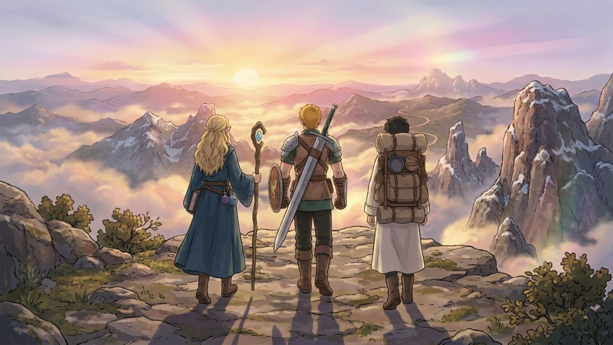
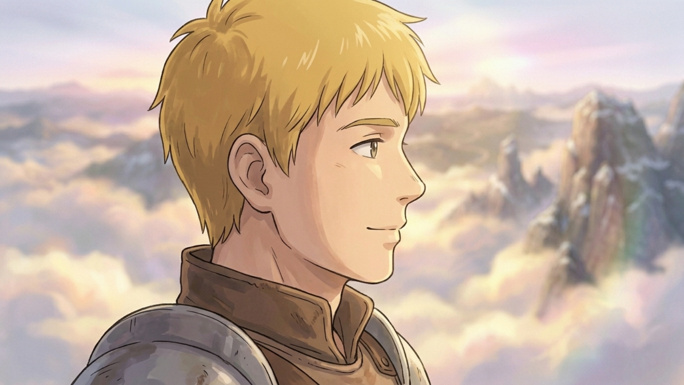
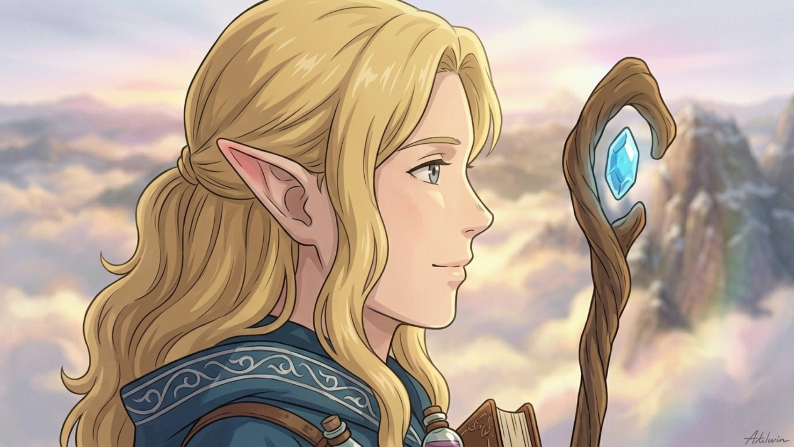

1. (編劇及場景): 規劃大致片段，每段5s
2. 角色設計速寫
3. 設計美術風格
4. 角色生成提示詞 + 生成
5. 場景生成提示詞 + 生成
6. 分鏡規劃
7. 影片

-->

8. 影片效果不然預期，重新規畫分鏡
9. 為分鏡創建劇照
10. 參考劇照生成影片

| 場景 | 影片 |
|---|---|
|||
|||
|||
||[]https://youtu.be/MPPaG3WGkhk)|
||[]https://youtu.be/i2NQspuic-w)|

失敗品

