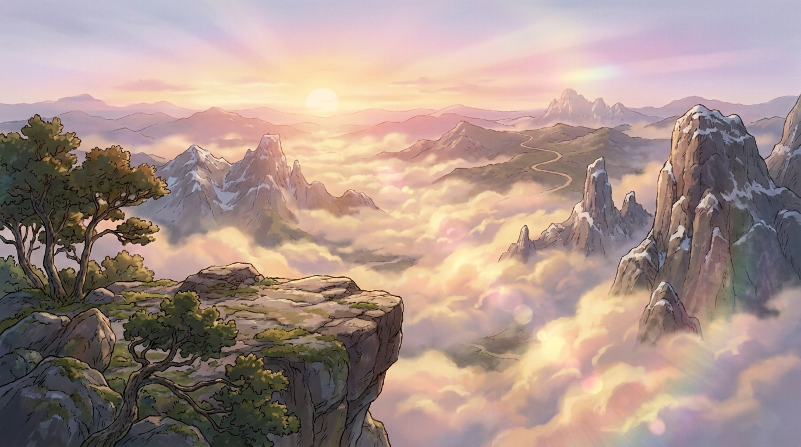

# 場景生成提示詞 + 生成




😊
```
為場景1建立生成提示詞
```

🤖
```
好，這為你提供不包含任何角色，純粹專注於描繪劇本【場景 1：清晨的遠眺】環境與大氣的場景設定提示詞。

這個版本的重點在於展現**「壯麗的奇幻山脈」**與**「清晨日出的光影質感」**，同樣保持「精緻治癒系．奇幻手繪風」的動畫風格。

---

### 場景 1：清晨的遠眺（純景觀版）

**視覺重點：**
* **環境：** 巍峨的雪山群、無盡的雲海、彎曲且遙遠的山徑。
* **光影：** 剛升起的日出（晨光），粉、金、紫的漸層。
* **氛圍：** 壯闊、寧靜、充滿希望與冒險感。
* **風格：** 高品質動畫美術、手繪水彩紋理、細膩的光暈效果（Bloom）。

#### 提示詞 (English)：
> **A panoramic, majestic anime landscape still from a fantasy journey film, representing "Scene 1: Morning Outlook." No characters visible.** High quality anime art, hand-drawn traditional watercolor with refined texture. **Perspective:** A wide-angle view from a rocky cliff edge overlooking a vast, breathtaking mountain range. **Environment:** Towering, snow-capped peaks dominate the distance, defined by soft yet detailed hand-drawn lines and layered paintwork. An endless sea of clouds fills the valleys below, swirling gently like a calm ocean. A tiny, precarious-looking mountain path can be traced winding its way through the far-off peaks, disappearing into the mist. **Lighting:** The newly risen sun (sunrise) is just breaking the horizon, casting a spectrum of soft, warm hues—gold, pink, pale orange, and light purple—across the sky and illuminating the cloud tips. The snow on the peaks glows with a gentle peach-colored light. The rocky foreground edge has soft, cool shadows. **Style:** Soft textured line art (sepia or dark warm gray lines, not sharp black) defining the geology. The atmosphere is breathable, peaceful, and filled with a gentle, realistic light bloom. The background mountains use atmospheric perspective with a soft blue haze. Ghibli style with refined Shinkai Makoto-style light diffusion and texture, incredibly detailed. Full panoramic view.

#### 提示詞摘要 (中文參考)：
> 奇幻旅程電影中的全景、壯觀動畫景觀劇照，代表「場景 1：清晨的遠眺」。無人物。高品質動畫美術，手繪水彩紋理。**視角：** 從岩石懸崖邊俯瞰廣闊山脈的廣角視野。**環境：** 遠處是巍峨、白雪皚皚的山峰，由柔和而細緻的手繪線條和分層繪畫定義。無盡的雲海填滿了下方的山谷，緩緩旋轉就像平靜的海洋。可以追溯到一條微小、看起來很不穩固的山路在遙遠的山峰間彎曲，消失在霧氣中。**光影：** 剛升起的太陽剛破平線，在天空中散佈金色、粉色、淡橘色和淺紫色的柔和暖色調，並照亮了雲尖。山峰上的雪地散發著柔和的桃色光芒。前景岩石邊緣有柔軟、涼爽的陰影。**風格：** 棕色柔和線條定義地質。有呼吸感。水彩背景，有呼吸感。皮膚透亮柔軟。上色為柔和賽璐璐，低飽和高明度。吉卜力氛圍加上細膩細節，精緻可愛。全身照。
```