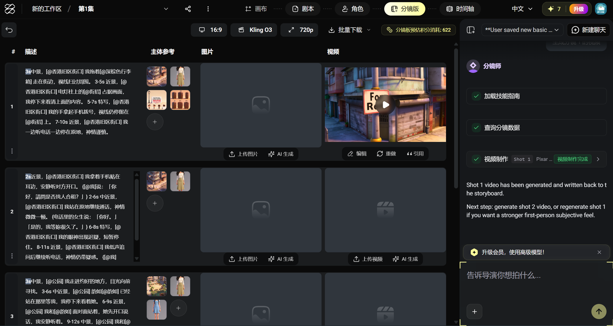

## 鬼故事ai動畫化

> 以現有短篇小說為基礎，完成以第一人稱敘事方式+場景對話重現

 

[提示詞](https://docs.google.com/spreadsheets/d/1PmkzqV6P8UsqN913o4YvXXSo4Qeo3W9Rjcax0rHOUpc/edit?gid=948724919#gid=948724919)

## 開發
| lab1 - google flow | lab2 - zopia |
|---|---|
|||

## 效果
| lab1 - veo | lab2 - kling |
|---|---|
|||
